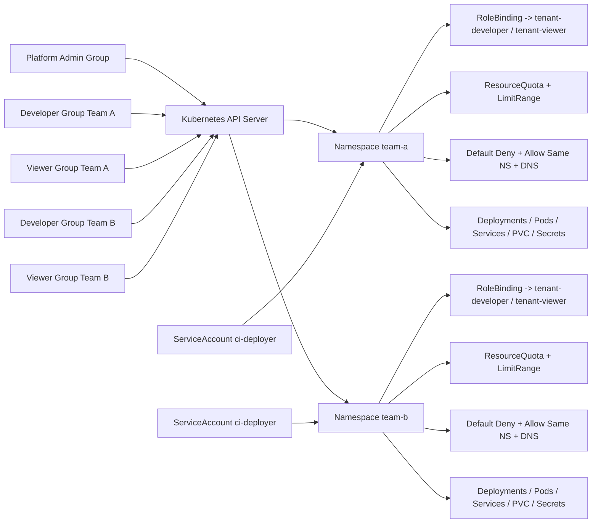

# DSAA 4040 多租户 Kubernetes 实验平台满分导向 Proposal

## 执行摘要

你们原来的题目选择是**合理且有明显高分潜力**的：它已经覆盖了多租户 Kubernetes 平台最核心的五个能力面——租户隔离、权限控制、资源治理、网络隔离、自动化运维。就技术可行性而言，Kubernetes 官方已经提供了完成这个项目所需的全部“原生积木”：RBAC、客户端证书认证、kubeconfig、多租户常用的 Namespace、ResourceQuota、LimitRange、NetworkPolicy，以及用于脚本化审批证书的 CSR 机制；K3s 和 Minikube 都可以承载课程级别的本地实验；Calico 还提供了比原生 NetworkPolicy 更强的平台级策略能力。citeturn10view7turn15view0turn11view8turn23view0turn19view4turn18view4turn10view10turn16view0turn17view0turn24view4

但如果目标不是“能做出来”，而是“可以直接交给 Codex 执行，并尽量冲击满分”，原 proposal 还需要升级为**工程规范型 proposal**。真正决定分数上限的，不再是多写几个概念，而是把每个要求都写成：**谁在什么 Namespace 做什么、执行什么命令、看到什么输出表示通过、失败时看什么日志、脚本返回码是什么**。下面这份版本，就是按“可自动化实现、可自动化验收、可自动化留痕”的标准重写的。  

在**课程评分细则未指定**的前提下，本报告采用“满分导向默认基线”：

- 发行版：**K3s**
- 网络方案：**Calico**
- 主线部署规模：**单节点**
- 租户模型：**一个团队一个 Namespace**
- 身份认证：**普通用户走 CSR 客户端证书，自动化任务走 ServiceAccount**
- 授权模型：**Admin / Developer / Viewer 三层**
- 治理模型：**每租户一套 ResourceQuota + LimitRange + 默认拒绝网络策略**
- 自动化：**一键 onboarding + 自动化验证报告**
- 演示最小闭环：**team-a / team-b 两个租户，三类角色，三类负向测试（越权、超额、穿透）**  

这个基线之所以推荐，是因为它兼顾了三件事：第一，**课程主线可稳定完成**；第二，**进阶目标可自然叠加**；第三，**Codex 很容易按目录和模板直接生成仓库**。citeturn25view1turn25view3turn26view2turn22view0

## 评分映射

### 评分要点映射表

> 课程官方评分标准：**未指定**。下表采用工程类课程最常见的评分维度进行“满分导向映射”。

| 推定评分维度 | 细则状态 | 满分导向要求 | 本 proposal 的应对方式 | 自动化证据 |
|---|---|---|---|---|
| 功能完整性 | 未指定 | Basic / Standard / Advanced 全覆盖 | 三层 RBAC、Namespace 隔离、Quota、LimitRange、NetworkPolicy、自动化、HA 讨论全部纳入 | `manifests/`、`scripts/`、`tests/` |
| 正确性与安全性 | 未指定 | 既有正向演示，也有失败用例 | 每项功能都有 allow/deny、pass/fail 双向测试 | `verification-report.txt`、CLI 输出、录像 |
| 自动化与复现性 | 未指定 | 助教可在 clean 环境快速复现 | bootstrap、onboard、verify、cleanup 一键化 | `README.md`、`Makefile`、返回码 |
| 工程质量 | 未指定 | 参数化、目录清晰、幂等 | 模板化 YAML、Group 绑定、声明式 apply | 模板清单、脚本结构 |
| 文档与表达 | 未指定 | README、报告、视频脚本完整 | 所有交付物结构预先定义 | `docs/`、`video/` |
| 进阶与创新 | 未指定 | 不只满足“能跑”，还要有平台化设计 | Calico、GNP、CSR 用户、自动测试报告、HA/持久化讨论 | Calico CRD、报告章节、附加实验 |
| 风险控制 | 未指定 | 主线必须稳定，扩展项不能拖垮主线 | 单节点主线 + 多节点可选加分 | 主线演示稳定完成 |

这张表背后的原则非常简单：**满分不是功能列表越长越好，而是“完成 + 可证明完成 + 工程化表达完整”**。对助教而言，最容易给高分的项目，往往不是最复杂的项目，而是最容易复现、最容易验证、最容易看出设计逻辑的项目。

## 架构与选型

### 推荐基线

推荐把主线固定为 **K3s + Calico + 单节点 Linux**。K3s 官方提供了轻量级集群、固定位置的管理员 kubeconfig、默认本地存储能力与 embedded etcd HA 演进路径；Calico 官方给出 K3s 与 Minikube 的快速安装文档，并提供 GlobalNetworkPolicy 等平台级策略能力；Minikube 适合作为备选实现或附加实验平台，但不建议把它作为课程主线，因为同类功能的实现路径更多、环境变量更多、故障面也更多。citeturn14view5turn25view1turn25view3turn26view2turn10view2turn27view2

### K3s 与 Minikube 对比

| 维度 | K3s | Minikube | 建议 |
|---|---|---|---|
| 定位 | 轻量级发行版，更接近真实小型集群 | 本地 Kubernetes 学习/实验环境 | 主线优先 K3s |
| 管理员 kubeconfig | 默认在 `/etc/rancher/k3s/k3s.yaml` | 由 profile 管理 | K3s 更适合脚本化 |
| 默认本地存储 | 自带 `local-path` | 默认 host-path provisioner | 单节点优先 K3s |
| 多节点 | 支持 | 支持 | 都能做扩展实验 |
| HA | embedded etcd HA | `--ha` 多控制平面实验 | 都适合写报告讨论 |
| 网络策略 | 内嵌 netpol controller，或替换为 Calico | 需支持的 CNI，如 Calico | 做进阶网络隔离时更建议 Calico |

表中结论综合自 K3s 官方的 cluster access、networking、storage、embedded etcd HA 文档，以及 Minikube 官方的 multi-node、persistent volumes、network policy 与 HA 教程。citeturn14view5turn16view0turn26view2turn10view2turn17view0turn10view3turn10view4turn27view2

### Calico 与 K3s 内置 NetworkPolicy 实现对比

| 维度 | Calico | K3s 内置 netpol controller | 建议 |
|---|---|---|---|
| Kubernetes NetworkPolicy | 支持 | 支持 | 两者都能达成基础隔离 |
| 平台级策略能力 | 更强 | 较弱 | 满分导向优先 Calico |
| 显式策略顺序 | 支持 | 无 | Calico 有优势 |
| GlobalNetworkPolicy | 支持 | 不支持 | 进阶加分更好展示 |
| 安装复杂度 | 略高 | 低 | 课程主线可接受这点复杂度 |

Minikube 官方明确指出，网络策略依赖支持它的 CNI；Calico 官方明确给出 GlobalNetworkPolicy 的非 namespaced 资源模型与策略顺序；K3s 官方则说明其内嵌实现来自 kube-router 的 network policy controller。citeturn10view4turn24view4turn24view2turn16view0

### 单节点与多节点对比

| 维度 | 单节点 | 多节点 |
|---|---|---|
| 实现复杂度 | 低 | 高 |
| 演示稳定性 | 高 | 中等 |
| 存储语义 | 清晰，便于讲解 | 需要额外讨论节点绑定和 CSI |
| 风险面 | 小 | 大 |
| 适合用途 | 主线实现与录屏 | 报告扩展、加分讨论、可选实验 |

K3s 的 HA 文档和 Minikube 的 HA 教程都说明了多节点可以做，但 Minikube 官方同时提醒，某些组件可能仍依附主节点；Kubernetes 官方还特别提醒 hostPath 有安全风险并会把工作负载绑定到节点语义上。citeturn10view2turn27view2turn21view2

### 默认参数

若课程没有额外指定，建议固定以下默认值：

| 参数 | 默认值 |
|---|---|
| 集群规模 | 单控制平面单节点 |
| 租户数 | 2 个，`team-a` / `team-b` |
| Namespace 标签 | `project=dsaa4040`, `tenant=<team-name>` |
| Developer 组 | `tenant:<team>:developers` |
| Viewer 组 | `tenant:<team>:viewers` |
| 平台管理员组 | `platform-admins` |
| 配额 | `requests.cpu=4`、`requests.memory=8Gi`、`limits.cpu=4`、`limits.memory=8Gi`、`pods=10` |
| 容器默认资源 | request `250m/256Mi`，limit `500m/512Mi` |
| 存储类 | K3s 用 `local-path`；Minikube 多节点建议 `csi-hostpath-sc` |

### 架构关系图



这个关系图严格对应 Kubernetes 官方推荐的多租户思路：用客户端证书识别用户和组，用 RBAC 在 Namespace 内授予权限，用 ResourceQuota 与 LimitRange 管理公平性，用 NetworkPolicy 管边界。Kubernetes 官方对 RBAC 良好实践还特别提醒：Namespace 是隔离不同信任等级与不同租户的自然单位，因此课程实现应以**团队级 Namespace**为边界，而不是“一个 Namespace 放多个不同信任级别的个人”。citeturn15view0turn10view7turn22view0turn19view4turn18view4turn10view10

## 验收目标

为了让 Codex 好实现、让助教好评分，每个目标都必须写成**可自动化验证的验收项**。Kubernetes 官方提供了 `kubectl auth can-i` 作为权限检查命令，也提供了 `kubectl auth whoami` 作为当前身份验证工具；ResourceQuota 违反时控制面会拒绝请求并返回 `403 Forbidden`；LimitRange 可以给 Pod 注入默认资源请求/限制；NetworkPolicy 决定选中 Pod 的白名单流量方向。citeturn15view2turn15view1turn19view4turn18view4turn10view10

### 可自动化验收表

| 等级 | 可交付成果 | 自动化命令 | 预期结果 | 通过条件 |
|---|---|---|---|---|
| Basic | 三层角色存在 | `kubectl --kubeconfig artifacts/team-a/users/dev-a/dev-a.kubeconfig auth whoami` | 显示 user 和 group | 用户证书与组映射正确 |
| Basic | Developer 可管理本租户 | `kubectl --kubeconfig artifacts/team-a/users/dev-a/dev-a.kubeconfig auth can-i create deployments.apps -n team-a -q` | 返回 0 | Developer 本租户可写 |
| Basic | Developer 不可访问他租户 | `kubectl --kubeconfig artifacts/team-a/users/dev-a/dev-a.kubeconfig auth can-i list pods -n team-b -q` | 返回非 0 | 无跨租户读权限 |
| Basic | Viewer 只读 | `kubectl --kubeconfig artifacts/team-a/users/viewer-a/viewer-a.kubeconfig auth can-i create deployments.apps -n team-a -q` | 返回非 0 | Viewer 无写权限 |
| Standard | Quota 已应用 | `kubectl describe quota tenant-quota -n team-a` | 显示 hard 限额 | 配额对象存在且值正确 |
| Standard | 超额配额被拒绝 | `kubectl --kubeconfig artifacts/team-a/users/dev-a/dev-a.kubeconfig apply -f tests/over-quota-pod.yaml -n team-a` | 失败，输出含 `exceeded quota` | 返回码非 0 |
| Standard | LimitRange 上界生效 | `kubectl --kubeconfig artifacts/team-a/users/dev-a/dev-a.kubeconfig apply -f tests/over-limit-pod.yaml -n team-a` | 失败，输出含资源上限违规信息 | 返回码非 0 |
| Standard | LimitRange 默认资源注入 | `kubectl --kubeconfig artifacts/team-a/users/dev-a/dev-a.kubeconfig apply -f tests/defaulted-pod.yaml -n team-a && kubectl --kubeconfig artifacts/team-a/users/dev-a/dev-a.kubeconfig get pod defaulted-pod -n team-a -o yaml` | Pod YAML 中出现默认 requests/limits | Admission 已注入默认值 |
| Advanced | 同 Namespace 互通 | `kubectl exec -n team-a deploy/client -- wget -T 3 -q -O /dev/null http://echo` | 返回 0 | 社内互通 |
| Advanced | 跨 Namespace 阻断 | `kubectl exec -n team-a deploy/client -- wget -T 3 -q -O /dev/null http://echo.team-b.svc.cluster.local` | 返回非 0 | 租户间默认不通 |
| Advanced | 一键 onboarding 成功 | `bash scripts/onboard-team.sh team-c dev-c viewer-c` | 返回 0，并生成验证报告 | 脚本可重复执行 |
| Advanced | Calico 进阶能力存在 | `kubectl get crd globalnetworkpolicies.crd.projectcalico.org` | CRD 存在 | 若选 Calico 路径则通过 |

### 推荐测试对象

建议仓库里固定三份测试 YAML，让助教能够一眼看懂你们检查的三种不同治理机制：

- `tests/defaulted-pod.yaml`：不写 resources，用于验证 LimitRange 默认注入  
- `tests/over-limit-pod.yaml`：请求值高于 LimitRange `max`  
- `tests/over-quota-pod.yaml`：单 Pod 请求高于 Namespace 的 Quota 允许总量  

这三份测试对象的组合，能把“默认值注入”“单 Pod 上界”“Namespace 总量上界”区分得非常清楚。

## RBAC 与认证

### 设计原则

Kubernetes 官方对 RBAC 的建议非常明确：**尽量在 Namespace 级别授权，尽量避免通配符，谨慎使用 `cluster-admin`，不要随便把人加进 `system:masters`**。同时，官方还强调：在一个 Namespace 中，创建工作负载的权限会隐式带来对 Secret、ConfigMap、PVC、ServiceAccount 等对象的连带访问能力。因此，正确的多租户建模不是“所有学生共用一个 Namespace 再靠 Role 分开”，而是**一个团队一个 Namespace，把 Namespace 当团队信任边界**。citeturn22view0

身份认证方面，Kubernetes 官方说明：普通用户不是集群里的 API 对象；系统通常依赖外部身份源，而 Kubernetes 只读取证书中的 `CN` 作为用户名、`O` 作为组。因此，本项目最合适的做法是：**为每个真实演示用户发客户端证书，但 RBAC 只绑定 Group，不为每个人重复写一套 RoleBinding**。citeturn15view0turn11view8

### 权限矩阵

| 资源/动作 | Admin | Developer | Viewer |
|---|---|---|---|
| Namespace / Node / PV / CSR 审批 / ClusterRoleBinding | 允许 | 禁止 | 禁止 |
| 本租户 Deployment / StatefulSet / Job / Service / ConfigMap / PVC | 完全允许 | 允许 CRUD | 只读 |
| 本租户 `pods/log` | 允许 | 允许 | 允许 |
| 本租户 `pods/exec` / `pods/portforward` | 允许 | 允许 | 禁止 |
| 本租户 Secret | 允许 | 允许 | 默认禁止 |
| 本租户 ResourceQuota / LimitRange / NetworkPolicy | 允许 | 只读 | 只读 |
| RBAC 对象 | 允许 | 禁止 | 禁止 |

### RBAC YAML 模板

下面这套模板采用“**通用 ClusterRole + Namespace 内 RoleBinding 限定作用域**”的方式。Kubernetes 官方 RBAC 文档明确支持 RoleBinding 引用 ClusterRole，从而把一套通用权限模板复用到多个 Namespace 里。citeturn10view7

#### 通用 ClusterRole 与平台管理员绑定

```yaml
apiVersion: rbac.authorization.k8s.io/v1
kind: ClusterRole
metadata:
  name: tenant-developer
rules:
  - apiGroups: [""]
    resources: ["pods", "pods/log", "services", "configmaps", "persistentvolumeclaims", "secrets"]
    verbs: ["get", "list", "watch", "create", "update", "patch", "delete"]
  - apiGroups: [""]
    resources: ["pods/exec", "pods/portforward"]
    verbs: ["create"]
  - apiGroups: [""]
    resources: ["events"]
    verbs: ["get", "list", "watch"]
  - apiGroups: ["apps"]
    resources: ["deployments", "replicasets", "statefulsets", "daemonsets"]
    verbs: ["get", "list", "watch", "create", "update", "patch", "delete"]
  - apiGroups: ["batch"]
    resources: ["jobs", "cronjobs"]
    verbs: ["get", "list", "watch", "create", "update", "patch", "delete"]
  - apiGroups: ["networking.k8s.io"]
    resources: ["ingresses"]
    verbs: ["get", "list", "watch", "create", "update", "patch", "delete"]
---
apiVersion: rbac.authorization.k8s.io/v1
kind: ClusterRole
metadata:
  name: tenant-viewer
rules:
  - apiGroups: [""]
    resources: ["pods", "pods/log", "services", "configmaps", "persistentvolumeclaims", "events"]
    verbs: ["get", "list", "watch"]
  - apiGroups: ["apps"]
    resources: ["deployments", "replicasets", "statefulsets", "daemonsets"]
    verbs: ["get", "list", "watch"]
  - apiGroups: ["batch"]
    resources: ["jobs", "cronjobs"]
    verbs: ["get", "list", "watch"]
  - apiGroups: ["networking.k8s.io"]
    resources: ["ingresses"]
    verbs: ["get", "list", "watch"]
---
apiVersion: rbac.authorization.k8s.io/v1
kind: ClusterRoleBinding
metadata:
  name: platform-admins-cluster-admin
subjects:
  - kind: Group
    name: platform-admins
    apiGroup: rbac.authorization.k8s.io
roleRef:
  kind: ClusterRole
  name: cluster-admin
  apiGroup: rbac.authorization.k8s.io
```

#### 每租户 Namespace 内的 Role、RoleBinding 与 ServiceAccount

```yaml
apiVersion: rbac.authorization.k8s.io/v1
kind: Role
metadata:
  name: tenant-governance-read
  namespace: __TENANT_NS__
rules:
  - apiGroups: [""]
    resources: ["resourcequotas", "limitranges", "events"]
    verbs: ["get", "list", "watch"]
  - apiGroups: ["networking.k8s.io"]
    resources: ["networkpolicies"]
    verbs: ["get", "list", "watch"]
---
apiVersion: rbac.authorization.k8s.io/v1
kind: RoleBinding
metadata:
  name: tenant-developer-binding
  namespace: __TENANT_NS__
subjects:
  - kind: Group
    name: __DEV_GROUP__
    apiGroup: rbac.authorization.k8s.io
roleRef:
  kind: ClusterRole
  name: tenant-developer
  apiGroup: rbac.authorization.k8s.io
---
apiVersion: rbac.authorization.k8s.io/v1
kind: RoleBinding
metadata:
  name: tenant-viewer-binding
  namespace: __TENANT_NS__
subjects:
  - kind: Group
    name: __VIEW_GROUP__
    apiGroup: rbac.authorization.k8s.io
roleRef:
  kind: ClusterRole
  name: tenant-viewer
  apiGroup: rbac.authorization.k8s.io
---
apiVersion: rbac.authorization.k8s.io/v1
kind: RoleBinding
metadata:
  name: tenant-governance-read-developers
  namespace: __TENANT_NS__
subjects:
  - kind: Group
    name: __DEV_GROUP__
    apiGroup: rbac.authorization.k8s.io
roleRef:
  kind: Role
  name: tenant-governance-read
  apiGroup: rbac.authorization.k8s.io
---
apiVersion: rbac.authorization.k8s.io/v1
kind: RoleBinding
metadata:
  name: tenant-governance-read-viewers
  namespace: __TENANT_NS__
subjects:
  - kind: Group
    name: __VIEW_GROUP__
    apiGroup: rbac.authorization.k8s.io
roleRef:
  kind: Role
  name: tenant-governance-read
  apiGroup: rbac.authorization.k8s.io
---
apiVersion: v1
kind: ServiceAccount
metadata:
  name: ci-deployer
  namespace: __TENANT_NS__
automountServiceAccountToken: true
---
apiVersion: rbac.authorization.k8s.io/v1
kind: RoleBinding
metadata:
  name: ci-deployer-tenant-developer
  namespace: __TENANT_NS__
subjects:
  - kind: ServiceAccount
    name: ci-deployer
    namespace: __TENANT_NS__
roleRef:
  kind: ClusterRole
  name: tenant-developer
  apiGroup: rbac.authorization.k8s.io
```

> 说明：这里故意不把 demo 用户做成 `system:masters`。K3s 自带的管理员 kubeconfig 只作为 bootstrap 凭据使用；真正演示时，Admin 也应该是一个普通组 `platform-admins` 绑定到 `cluster-admin`，这样更符合官方 RBAC 最小惊讶原则。citeturn22view0turn14view5

### 证书签发与 kubeconfig 流程

Kubernetes 官方客户端证书任务文档给出的标准流程就是：生成私钥、生成 CSR、本地编码进 Kubernetes CSR 对象、由管理员审批、导出证书、再写入 kubeconfig。citeturn11view8

#### CSR 创建与审批

```bash
export BOOTSTRAP_KUBECONFIG=/etc/rancher/k3s/k3s.yaml
export USERNAME=dev-a
export GROUP='tenant:team-a:developers'
export OUTDIR=artifacts/team-a/users/${USERNAME}

mkdir -p "${OUTDIR}"

openssl genrsa -out "${OUTDIR}/${USERNAME}.key" 3072
openssl req -new \
  -key "${OUTDIR}/${USERNAME}.key" \
  -out "${OUTDIR}/${USERNAME}.csr" \
  -subj "/CN=${USERNAME}/O=${GROUP}"

CSR_B64="$(base64 -w0 < "${OUTDIR}/${USERNAME}.csr")"

cat > "${OUTDIR}/${USERNAME}-csr.yaml" <<EOF
apiVersion: certificates.k8s.io/v1
kind: CertificateSigningRequest
metadata:
  name: ${USERNAME}
spec:
  request: ${CSR_B64}
  signerName: kubernetes.io/kube-apiserver-client
  expirationSeconds: 31536000
  usages:
    - client auth
EOF

kubectl --kubeconfig "${BOOTSTRAP_KUBECONFIG}" apply -f "${OUTDIR}/${USERNAME}-csr.yaml"
kubectl --kubeconfig "${BOOTSTRAP_KUBECONFIG}" certificate approve "${USERNAME}"
kubectl --kubeconfig "${BOOTSTRAP_KUBECONFIG}" get csr "${USERNAME}" \
  -o jsonpath='{.status.certificate}' | base64 -d > "${OUTDIR}/${USERNAME}.crt"
```

#### 生成 kubeconfig

```bash
export SERVER="$(kubectl --kubeconfig "${BOOTSTRAP_KUBECONFIG}" config view --raw -o jsonpath='{.clusters[0].cluster.server}')"
export CA_DATA="$(kubectl --kubeconfig "${BOOTSTRAP_KUBECONFIG}" config view --raw -o jsonpath='{.clusters[0].cluster.certificate-authority-data}')"

echo "${CA_DATA}" | base64 -d > "${OUTDIR}/ca.crt"

kubectl config --kubeconfig "${OUTDIR}/${USERNAME}.kubeconfig" \
  set-cluster dsaa4040-lab \
  --server="${SERVER}" \
  --certificate-authority="${OUTDIR}/ca.crt" \
  --embed-certs=true

kubectl config --kubeconfig "${OUTDIR}/${USERNAME}.kubeconfig" \
  set-credentials "${USERNAME}" \
  --client-certificate="${OUTDIR}/${USERNAME}.crt" \
  --client-key="${OUTDIR}/${USERNAME}.key" \
  --embed-certs=true

kubectl config --kubeconfig "${OUTDIR}/${USERNAME}.kubeconfig" \
  set-context "${USERNAME}@dsaa4040-lab" \
  --cluster=dsaa4040-lab \
  --user="${USERNAME}" \
  --namespace=team-a

kubectl config --kubeconfig "${OUTDIR}/${USERNAME}.kubeconfig" \
  use-context "${USERNAME}@dsaa4040-lab"

kubectl --kubeconfig "${OUTDIR}/${USERNAME}.kubeconfig" auth whoami
```

#### kubeconfig 模板

```yaml
apiVersion: v1
kind: Config
clusters:
  - name: __CLUSTER_NAME__
    cluster:
      server: __SERVER__
      certificate-authority-data: __CA_CERT_B64__
users:
  - name: __USERNAME__
    user:
      client-certificate-data: __CLIENT_CERT_B64__
      client-key-data: __CLIENT_KEY_B64__
contexts:
  - name: __USERNAME__@__CLUSTER_NAME__
    context:
      cluster: __CLUSTER_NAME__
      user: __USERNAME__
      namespace: __TENANT_NS__
current-context: __USERNAME__@__CLUSTER_NAME__
```

Kubernetes 官方对 kubeconfig 还有两个必须写进报告的要点：第一，`kubectl` 默认读 `$HOME/.kube/config`，也可以通过 `KUBECONFIG` 或 `--kubeconfig` 指定；第二，只能信任来源可靠的 kubeconfig。K3s 官方还提醒，如果把 `/etc/rancher/k3s/k3s.yaml` 复制到集群外使用，要把 `server` 字段改成真实服务器地址。citeturn23view0turn14view5

## 资源、网络与存储

### ResourceQuota 与 LimitRange

Kubernetes 官方说明，ResourceQuota 用于限制 Namespace 的总资源消耗、对象数量和基础设施资源；违反配额会被 API 服务器拒绝。LimitRange 则用于给 Pod、Container 或 PVC 设置最小值、最大值以及默认 requests/limits。官方还特别指出：如果 Namespace 对 `cpu` 或 `memory` 设置了配额，而用户没有写相应 request/limit，Admission 可能直接拒绝该 Pod；因此在工程实践中，ResourceQuota 与 LimitRange 必须搭配使用。citeturn19view4turn18view4

#### ResourceQuota 模板

```yaml
apiVersion: v1
kind: ResourceQuota
metadata:
  name: tenant-quota
  namespace: __TENANT_NS__
spec:
  hard:
    requests.cpu: "__RQ_CPU_REQUESTS__"
    requests.memory: "__RQ_MEM_REQUESTS__"
    limits.cpu: "__RQ_CPU_LIMITS__"
    limits.memory: "__RQ_MEM_LIMITS__"
    pods: "__RQ_PODS__"
    persistentvolumeclaims: "__RQ_PVCS__"
    requests.storage: "__RQ_STORAGE__"
    configmaps: "20"
    secrets: "20"
    services: "10"
```

#### LimitRange 模板

```yaml
apiVersion: v1
kind: LimitRange
metadata:
  name: tenant-limits
  namespace: __TENANT_NS__
spec:
  limits:
    - type: Container
      min:
        cpu: "100m"
        memory: "128Mi"
      max:
        cpu: "2"
        memory: "2Gi"
      defaultRequest:
        cpu: "250m"
        memory: "256Mi"
      default:
        cpu: "500m"
        memory: "512Mi"
    - type: PersistentVolumeClaim
      min:
        storage: "1Gi"
      max:
        storage: "10Gi"
```

### NetworkPolicy

Kubernetes 官方对 NetworkPolicy 的语义非常适合直接写进最终报告：在没有任何策略时，Pod 流量默认允许；一旦某 Pod 被带有 `Ingress` 或 `Egress` 的策略选中，该方向上的流量就转为白名单；要实现默认拒绝，就要先写一条选择全部 Pod、但不允许任何流量的策略。官方同时提醒，如果出站被默认拒绝，DNS 也会一起被拦住。citeturn10view10

基于这个语义，本项目建议固定三条策略：

#### 默认拒绝全部进出流量

```yaml
apiVersion: networking.k8s.io/v1
kind: NetworkPolicy
metadata:
  name: default-deny-all
  namespace: __TENANT_NS__
spec:
  podSelector: {}
  policyTypes:
    - Ingress
    - Egress
```

#### 允许同 Namespace 内互通

```yaml
apiVersion: networking.k8s.io/v1
kind: NetworkPolicy
metadata:
  name: allow-same-namespace
  namespace: __TENANT_NS__
spec:
  podSelector: {}
  policyTypes:
    - Ingress
    - Egress
  ingress:
    - from:
        - podSelector: {}
  egress:
    - to:
        - podSelector: {}
```

#### 允许 DNS 出站

> 假设 bootstrap 阶段执行了：`kubectl label namespace kube-system name=kube-system --overwrite`

```yaml
apiVersion: networking.k8s.io/v1
kind: NetworkPolicy
metadata:
  name: allow-dns-egress
  namespace: __TENANT_NS__
spec:
  podSelector: {}
  policyTypes:
    - Egress
  egress:
    - to:
        - namespaceSelector:
            matchLabels:
              name: kube-system
          podSelector:
            matchLabels:
              k8s-app: kube-dns
      ports:
        - protocol: UDP
          port: 53
        - protocol: TCP
          port: 53
```

### Calico 进阶特性

Calico 官方明确说明 `GlobalNetworkPolicy` 是**非 namespaced** 资源，支持策略顺序、全局选择器和跨 Namespace 工作负载匹配。因此，如果你们选择 Calico 路径，最适合拿来做“平台化加分”的，不是简单重复写 Kubernetes NetworkPolicy，而是加上一条平台级策略，体现“平台统一基线”。citeturn24view4turn24view2

#### Calico GlobalNetworkPolicy 示例

```yaml
apiVersion: projectcalico.org/v3
kind: GlobalNetworkPolicy
metadata:
  name: dsaa4040-allow-dns-egress
spec:
  order: 100
  namespaceSelector: project == "dsaa4040"
  selector: all()
  types:
    - Egress
  egress:
    - action: Allow
      protocol: UDP
      destination:
        namespaceSelector: projectcalico.org/name == 'kube-system'
        selector: k8s-app == 'kube-dns'
        ports:
          - 53
    - action: Allow
      protocol: TCP
      destination:
        namespaceSelector: projectcalico.org/name == 'kube-system'
        selector: k8s-app == 'kube-dns'
        ports:
          - 53
```

如果采用 **K3s 内嵌 network policy controller** 路径，则前面三条标准 `networking.k8s.io/v1` 的 NetworkPolicy 足够完成课程目标；但**不要**再应用任何 Calico CRD 对象。K3s 官方还特别提醒，关闭内嵌 netpol controller 后旧的 kube-router iptables 规则不会自动清理，因此项目一开始就应固定网络路线，不要中途切换。citeturn16view0

### 存储与持久化

K3s 官方文档说明，它自带 Rancher 的 Local Path Provisioner，可以直接使用 `local-path` 做动态 PVC；Minikube 官方则说明默认 host-path provisioner 不适合多节点，需要 `csi-hostpath-driver` 或 `local-path-provisioner`。Kubernetes 官方对 `hostPath` 还给出非常明确的安全警告：它会暴露主机文件系统、带来容器逃逸风险、造成节点差异和磁盘管理风险，因此不应随意作为“普通租户可创建的裸能力”开放。citeturn26view2turn17view0turn10view3turn21view2

#### PVC 模板

```yaml
apiVersion: v1
kind: PersistentVolumeClaim
metadata:
  name: app-data
  namespace: __TENANT_NS__
spec:
  accessModes:
    - ReadWriteOnce
  storageClassName: __STORAGE_CLASS__
  resources:
    requests:
      storage: 2Gi
```

### 高可用与持久化讨论

这一块建议作为**进阶章节和加分点**，而不要成为主线交付依赖。

- **K3s 路线**：官方支持 embedded etcd HA，既可直接从 `--cluster-init` 启动，也可把现有单节点 SQLite 集群演进到 etcd。  
- **Minikube 路线**：官方提供 `minikube start --ha` 的多控制平面实验，使用 stacked control plane + colocated etcd + kube-vip；但官方同文也提醒，某些组件如 storage-provisioner 可能依附主节点。  
- **单节点局限**：节点失效意味着控制平面与本地存储同时失效；PVC 通常绑定在本地节点语义上。  
- **多节点建议**：如果只是课程演示，建议把多节点放在“讨论 + 可选试验”；如果要真正做多节点持久化，应使用真正支持多节点的 CSI 路线，而不是继续依赖裸 hostPath。 K3s 官方文档还列出 Longhorn 作为分布式块存储示例，可作为可选加分项，但不应拖慢主线。citeturn10view2turn27view2turn26view2turn21view2

## 自动化与测试

### 一键 onboarding 的目标

一键 onboarding 脚本至少应当完成以下动作：

1. 创建并标记 Namespace  
2. 应用通用 RBAC 资源与租户内 RoleBinding  
3. 应用 Quota、LimitRange、NetworkPolicy  
4. 为 Developer/Viewer 生成私钥与 CSR  
5. 代表管理员审批 CSR 并导出证书  
6. 生成每个用户的 kubeconfig  
7. 执行最基本的 `auth can-i` 检查  
8. 输出验证报告文件  

这里之所以能完全脚本化，是因为 Kubernetes 官方对 CSR 签发、kubeconfig 组织访问、`auth can-i`、`auth whoami` 都给了稳定路径。citeturn11view8turn23view0turn15view2turn15view1

### `scripts/onboard-team.sh` 示例

下面这份脚本样板已经足够让 Codex 直接落地。它假设前文的模板文件按文末仓库结构保存在 `manifests/` 中。

```bash
#!/usr/bin/env bash
set -euo pipefail

RC_PREREQ=10
RC_APPLY=20
RC_CERT=30
RC_VERIFY=50

BOOTSTRAP_KUBECONFIG="${BOOTSTRAP_KUBECONFIG:-/etc/rancher/k3s/k3s.yaml}"

TENANT_NS="${1:?usage: onboard-team.sh <tenant-namespace> [dev-users-csv] [viewer-users-csv]}"
DEV_USERS_CSV="${2:-dev-${TENANT_NS}}"
VIEW_USERS_CSV="${3:-viewer-${TENANT_NS}}"

DEV_GROUP="tenant:${TENANT_NS}:developers"
VIEW_GROUP="tenant:${TENANT_NS}:viewers"

RQ_CPU_REQUESTS="${RQ_CPU_REQUESTS:-4}"
RQ_MEM_REQUESTS="${RQ_MEM_REQUESTS:-8Gi}"
RQ_CPU_LIMITS="${RQ_CPU_LIMITS:-4}"
RQ_MEM_LIMITS="${RQ_MEM_LIMITS:-8Gi}"
RQ_PODS="${RQ_PODS:-10}"
RQ_PVCS="${RQ_PVCS:-4}"
RQ_STORAGE="${RQ_STORAGE:-20Gi}"
STORAGE_CLASS="${STORAGE_CLASS:-local-path}"

ARTIFACT_DIR="artifacts/${TENANT_NS}"
USERS_DIR="${ARTIFACT_DIR}/users"

need() {
  command -v "$1" >/dev/null 2>&1 || {
    echo "missing command: $1" >&2
    exit "${RC_PREREQ}"
  }
}

render() {
  sed \
    -e "s|__TENANT_NS__|${TENANT_NS}|g" \
    -e "s|__DEV_GROUP__|${DEV_GROUP}|g" \
    -e "s|__VIEW_GROUP__|${VIEW_GROUP}|g" \
    -e "s|__RQ_CPU_REQUESTS__|${RQ_CPU_REQUESTS}|g" \
    -e "s|__RQ_MEM_REQUESTS__|${RQ_MEM_REQUESTS}|g" \
    -e "s|__RQ_CPU_LIMITS__|${RQ_CPU_LIMITS}|g" \
    -e "s|__RQ_MEM_LIMITS__|${RQ_MEM_LIMITS}|g" \
    -e "s|__RQ_PODS__|${RQ_PODS}|g" \
    -e "s|__RQ_PVCS__|${RQ_PVCS}|g" \
    -e "s|__RQ_STORAGE__|${RQ_STORAGE}|g" \
    -e "s|__STORAGE_CLASS__|${STORAGE_CLASS}|g" \
    "$1"
}

apply_template() {
  render "$1" | kubectl --kubeconfig "${BOOTSTRAP_KUBECONFIG}" apply -f - >/dev/null
}

issue_user_cert() {
  local username="$1"
  local group="$2"
  local out="${USERS_DIR}/${username}"

  mkdir -p "${out}"

  openssl genrsa -out "${out}/${username}.key" 3072 >/dev/null 2>&1
  openssl req -new -key "${out}/${username}.key" \
    -out "${out}/${username}.csr" \
    -subj "/CN=${username}/O=${group}" >/dev/null 2>&1

  local csr_b64
  csr_b64="$(base64 -w0 < "${out}/${username}.csr")"

  cat > "${out}/${username}-csr.yaml" <<EOF
apiVersion: certificates.k8s.io/v1
kind: CertificateSigningRequest
metadata:
  name: ${username}
spec:
  request: ${csr_b64}
  signerName: kubernetes.io/kube-apiserver-client
  expirationSeconds: 31536000
  usages:
    - client auth
EOF

  kubectl --kubeconfig "${BOOTSTRAP_KUBECONFIG}" apply -f "${out}/${username}-csr.yaml" >/dev/null
  kubectl --kubeconfig "${BOOTSTRAP_KUBECONFIG}" certificate approve "${username}" >/dev/null
  kubectl --kubeconfig "${BOOTSTRAP_KUBECONFIG}" get csr "${username}" \
    -o jsonpath='{.status.certificate}' | base64 -d > "${out}/${username}.crt"

  local server ca_data
  server="$(kubectl --kubeconfig "${BOOTSTRAP_KUBECONFIG}" config view --raw -o jsonpath='{.clusters[0].cluster.server}')"
  ca_data="$(kubectl --kubeconfig "${BOOTSTRAP_KUBECONFIG}" config view --raw -o jsonpath='{.clusters[0].cluster.certificate-authority-data}')"
  echo "${ca_data}" | base64 -d > "${out}/ca.crt"

  kubectl config --kubeconfig "${out}/${username}.kubeconfig" \
    set-cluster dsaa4040-lab \
    --server="${server}" \
    --certificate-authority="${out}/ca.crt" \
    --embed-certs=true >/dev/null
  kubectl config --kubeconfig "${out}/${username}.kubeconfig" \
    set-credentials "${username}" \
    --client-certificate="${out}/${username}.crt" \
    --client-key="${out}/${username}.key" \
    --embed-certs=true >/dev/null
  kubectl config --kubeconfig "${out}/${username}.kubeconfig" \
    set-context "${username}@dsaa4040-lab" \
    --cluster=dsaa4040-lab \
    --user="${username}" \
    --namespace="${TENANT_NS}" >/dev/null
  kubectl config --kubeconfig "${out}/${username}.kubeconfig" \
    use-context "${username}@dsaa4040-lab" >/dev/null
}

main() {
  need kubectl
  need openssl
  need base64

  mkdir -p "${USERS_DIR}"

  kubectl --kubeconfig "${BOOTSTRAP_KUBECONFIG}" get ns "${TENANT_NS}" >/dev/null 2>&1 || \
    kubectl --kubeconfig "${BOOTSTRAP_KUBECONFIG}" create ns "${TENANT_NS}" >/dev/null

  kubectl --kubeconfig "${BOOTSTRAP_KUBECONFIG}" label ns "${TENANT_NS}" project=dsaa4040 tenant="${TENANT_NS}" --overwrite >/dev/null
  kubectl --kubeconfig "${BOOTSTRAP_KUBECONFIG}" label ns kube-system name=kube-system --overwrite >/dev/null || true

  kubectl --kubeconfig "${BOOTSTRAP_KUBECONFIG}" apply -f manifests/rbac/clusterroles.yaml >/dev/null
  kubectl --kubeconfig "${BOOTSTRAP_KUBECONFIG}" apply -f manifests/rbac/admin-binding.yaml >/dev/null

  apply_template manifests/templates/tenant-rbac.yaml.tpl
  apply_template manifests/templates/tenant-quota.yaml.tpl
  apply_template manifests/templates/tenant-limits.yaml.tpl
  apply_template manifests/templates/netpol-default-deny.yaml.tpl
  apply_template manifests/templates/netpol-allow-same-namespace.yaml.tpl
  apply_template manifests/templates/netpol-allow-dns.yaml.tpl

  IFS=',' read -ra dev_users <<< "${DEV_USERS_CSV}"
  IFS=',' read -ra view_users <<< "${VIEW_USERS_CSV}"

  for u in "${dev_users[@]}"; do
    issue_user_cert "${u}" "${DEV_GROUP}"
  done
  for u in "${view_users[@]}"; do
    issue_user_cert "${u}" "${VIEW_GROUP}"
  done

  local report="${ARTIFACT_DIR}/verification-report.txt"
  {
    echo "[tenant] ${TENANT_NS}"
    echo "[developer_group] ${DEV_GROUP}"
    echo "[viewer_group] ${VIEW_GROUP}"
    echo
    echo "[developer can create deployments]"
    kubectl --kubeconfig "${USERS_DIR}/${dev_users[0]}/${dev_users[0]}.kubeconfig" auth can-i create deployments.apps -n "${TENANT_NS}"
    echo
    echo "[viewer can create deployments]"
    kubectl --kubeconfig "${USERS_DIR}/${view_users[0]}/${view_users[0]}.kubeconfig" auth can-i create deployments.apps -n "${TENANT_NS}"
    echo
    echo "[resource quota]"
    kubectl --kubeconfig "${BOOTSTRAP_KUBECONFIG}" get quota tenant-quota -n "${TENANT_NS}" -o wide
    echo
    echo "[limit range]"
    kubectl --kubeconfig "${BOOTSTRAP_KUBECONFIG}" get limitrange tenant-limits -n "${TENANT_NS}" -o wide
  } > "${report}"

  echo "onboarding complete: ${TENANT_NS}"
  echo "report: ${report}"
}

main "$@"
```

### 测试计划

| 测试主题 | 命令 | 预期结果 | 通过标准 |
|---|---|---|---|
| Developer 越权访问其他租户 | `kubectl --kubeconfig dev-a.kubeconfig get pods -n team-b` | 报错 `Forbidden` | 返回码非 0 |
| Viewer 越权写入 | `kubectl --kubeconfig viewer-a.kubeconfig apply -f examples/ok-deployment.yaml -n team-a` | 被拒绝 | 返回码非 0 |
| Quota 超额 | `kubectl --kubeconfig dev-a.kubeconfig apply -f tests/over-quota-pod.yaml -n team-a` | 返回配额错误 | 输出含 `exceeded quota` |
| LimitRange 违规 | `kubectl --kubeconfig dev-a.kubeconfig apply -f tests/over-limit-pod.yaml -n team-a` | 返回资源限制错误 | 返回码非 0 |
| 同 Namespace 互通 | `kubectl exec -n team-a deploy/client -- wget -T 3 -q -O /dev/null http://echo` | 成功 | 返回码 0 |
| 跨 Namespace 穿透 | `kubectl exec -n team-a deploy/client -- wget -T 3 -q -O /dev/null http://echo.team-b.svc.cluster.local` | 失败 | 返回码非 0 |
| 自动化回归 | `bash scripts/onboard-team.sh team-z dev-z viewer-z` | 生成全部配置与报告 | 返回码 0 且文件存在 |

### 可直接交给 Codex 的执行约束

```text
1. 默认主线环境固定为 Linux + K3s + Calico。
2. 所有基础设施配置必须声明式保存在 YAML 中，不允许只靠手工 kubectl create 命令堆结果。
3. 所有脚本必须无交互、可重复执行、提供明确返回码。
4. 普通用户必须通过 CSR + kubeconfig 演示，不能只靠 --as 伪装。
5. 一个团队一个 Namespace，不做“每人一个 Namespace”。
6. RBAC 绑定优先绑定 Group，而不是为每个用户复制 RoleBinding。
7. 所有目标都必须有自动化验证命令和通过标准。
8. 主线先稳做单节点；多节点/HA 只能作为加分项，不能阻断主线。
9. 如果选择 K3s 内置 network policy 路径，则不得提交 Calico CRD；如果选择 Calico，则 K3s 启动时必须禁用 flannel 和内置 network policy。
10. 所有产物必须落盘：YAML、脚本、用户 kubeconfig、验证报告、README、视频脚本、报告提纲。
```

## 交付物与里程碑

### 建议仓库结构

```text
multi-tenant-k8s-lab/
├── README.md
├── Makefile
├── manifests/
│   ├── rbac/
│   │   ├── clusterroles.yaml
│   │   └── admin-binding.yaml
│   ├── templates/
│   │   ├── tenant-rbac.yaml.tpl
│   │   ├── tenant-quota.yaml.tpl
│   │   ├── tenant-limits.yaml.tpl
│   │   ├── netpol-default-deny.yaml.tpl
│   │   ├── netpol-allow-same-namespace.yaml.tpl
│   │   ├── netpol-allow-dns.yaml.tpl
│   │   └── calico-global-dns.yaml.tpl
│   └── examples/
│       ├── ok-deployment.yaml
│       ├── echo-server.yaml
│       └── client.yaml
├── scripts/
│   ├── bootstrap-k3s-calico.sh
│   ├── bootstrap-minikube-calico.sh
│   ├── onboard-team.sh
│   ├── verify-lab.sh
│   └── cleanup-team.sh
├── tests/
│   ├── defaulted-pod.yaml
│   ├── over-limit-pod.yaml
│   ├── over-quota-pod.yaml
│   └── network-e2e.sh
├── artifacts/
│   └── .gitkeep
├── docs/
│   ├── proposal.md
│   ├── report-outline.md
│   ├── demo-script.md
│   └── architecture.md
└── video/
    └── screenshots/
```

### README 模板

```markdown
# Multi-Tenant Kubernetes Lab Platform with RBAC and Resource Isolation

## Course Information
- Course: DSAA 4040 Cloud Computing & Big Data Systems
- Project ID: E3
- Team Members: <name list>

## Overview
This project builds a multi-tenant Kubernetes lab platform with:
- namespace-based tenant isolation
- three-level RBAC
- ResourceQuota and LimitRange
- NetworkPolicy-based isolation
- automated onboarding for new teams

## Architecture
- Kubernetes distro: K3s (recommended) / Minikube (alternative)
- Network plugin: Calico / K3s built-in fallback
- Storage: local-path / csi-hostpath-sc
- Auth: CSR-based client certificates + ServiceAccounts

## Quick Start
```bash
bash scripts/bootstrap-k3s-calico.sh
bash scripts/onboard-team.sh team-a dev-a viewer-a
bash scripts/onboard-team.sh team-b dev-b viewer-b
bash scripts/verify-lab.sh
```

## Roles
- Admin: full cluster admin
- Developer: CRUD inside own tenant namespace
- Viewer: read-only inside own tenant namespace

## Acceptance Criteria
- Developer A cannot list Team B pods
- Viewer cannot create workloads
- Quota blocks overconsumption
- LimitRange injects defaults and blocks invalid specs
- Cross-namespace communication is blocked by default
- Same-namespace communication works

## Repository Structure
<copy tree here>

## Cleanup
```bash
bash scripts/cleanup-team.sh team-a
bash scripts/cleanup-team.sh team-b
```
```

### 演示视频脚本要点

| 场景 | 演示命令 | 要展示的结论 |
|---|---|---|
| 集群与 Namespace | `kubectl get nodes && kubectl get ns` | 平台已初始化、租户已建立 |
| Developer 正常权限 | `kubectl --kubeconfig dev-a.kubeconfig get pods -n team-a` | Developer 可操作本租户 |
| Developer 越权失败 | `kubectl --kubeconfig dev-a.kubeconfig get pods -n team-b` | 跨租户 RBAC 隔离生效 |
| Viewer 只读 | `kubectl --kubeconfig viewer-a.kubeconfig apply -f examples/ok-deployment.yaml -n team-a` | Viewer 无写权限 |
| Quota 超额失败 | `kubectl --kubeconfig dev-a.kubeconfig apply -f tests/over-quota-pod.yaml -n team-a` | 资源总量治理生效 |
| LimitRange 违规失败 | `kubectl --kubeconfig dev-a.kubeconfig apply -f tests/over-limit-pod.yaml -n team-a` | 单 Pod 上界治理生效 |
| 同租户网络互通 | `kubectl exec -n team-a deploy/client -- wget ... http://echo` | 同 Namespace 允许 |
| 跨租户网络失败 | `kubectl exec -n team-a deploy/client -- wget ... http://echo.team-b.svc.cluster.local` | 默认跨租户阻断 |
| 自动化能力 | `bash scripts/onboard-team.sh team-c dev-c viewer-c` | 可一键接纳新团队 |

### 最终报告结构大纲

| 章节 | 内容 |
|---|---|
| 摘要 | 项目目标、方法、结果概览 |
| 背景与问题定义 | 为什么需要多租户实验平台 |
| 架构设计 | K3s/Minikube 选型、Calico、Namespace 模型 |
| RBAC 设计 | 角色矩阵、证书用户、Group 绑定 |
| 资源治理 | ResourceQuota + LimitRange 设计逻辑 |
| 网络隔离 | 默认拒绝、同租户允许、跨租户失败 |
| 自动化实现 | onboarding 脚本、kubeconfig 生成、报告输出 |
| 测试结果 | 正向与负向测试截图或输出 |
| 局限与扩展 | 单节点限制、多节点与 HA、持久化建议 |
| 结论 | 项目价值与课程收获 |

### 里程碑

| 阶段 | 目标 | 产物 |
|---|---|---|
| 环境冻结 | 选定 K3s + Calico 主线并跑通安装 | `bootstrap-k3s-calico.sh` |
| 权限与认证 | 完成 CSR 用户、RBAC、租户 Namespace | `clusterroles.yaml`、`tenant-rbac.yaml.tpl` |
| 治理与隔离 | 完成 Quota、LimitRange、NetworkPolicy | `tenant-quota.yaml.tpl`、`tenant-limits.yaml.tpl`、`netpol-*.yaml.tpl` |
| 自动化 | 完成 onboarding、verify、cleanup | `onboard-team.sh`、`verify-lab.sh` |
| 证据化交付 | 补齐 README、报告、视频脚本、截图 | `README.md`、`report-outline.md`、`demo-script.md` |
| 冲高分扩展 | 完成 HA/多节点讨论或可选实验 | 附录、额外演示 |

### 最终判断

如果只从“题目本身是否值得做、是否足以冲满分”来判断，答案是：**是的，这个题目完全够格，而且方向是对的**。真正影响上限的，不在题目，而在执行方式。把它做成“概念性实验”，大概率是一个中上分项目；把它做成这份报告定义的这种“可自动化实现、可自动化验证、可自动化留证据”的仓库，才是**最接近满分答案**的做法。